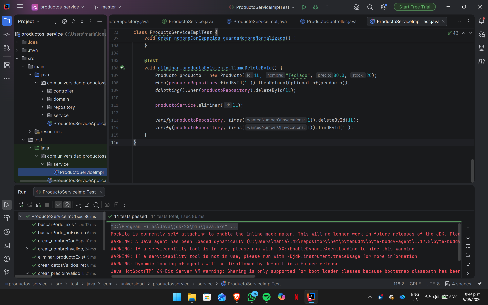

productos-service — Post-Contenido 1, Unidad 9
Patrones de Diseño de Software · Ingeniería de Sistemas · 2026
Universidad de Santander (UDES)

Descripción del Proyecto
Microservicio de gestión de productos desarrollado con Spring Boot 3.3 y Java 21.
El proyecto implementa una suite completa de pruebas unitarias sobre la capa de
servicio, aplicando JUnit 5 y Mockito para aislar la lógica de negocio de sus
dependencias externas (repositorio JPA), verificar comportamientos con assertions
específicas, y cubrir escenarios de error mediante pruebas parametrizadas y
captura de argumentos con ArgumentCaptor.

Tecnologías Utilizadas
TecnologíaVersiónRol en el proyectoJava21Lenguaje de implementaciónSpring Boot3.3.xFramework base del microservicioSpring Data JPA(incluido)Capa de persistenciaH2 Database(incluido)Base de datos en memoria para pruebasLombok(incluido)Reducción de código boilerplateJUnit 5 (Jupiter)(incluido)Motor de ejecución de pruebasMockito(incluido)Framework de Test DoublesMaven3.9+Gestión de dependencias y build

Las versiones marcadas como "(incluido)" son gestionadas automáticamente
por spring-boot-starter-test a través del BOM de Spring Boot 3.3.

Estructura del Proyecto
productos-service/
├── src/
│   ├── main/
│   │   └── java/com/universidad/productosservice/
│   │       ├── ProductosServiceApplication.java
│   │       ├── domain/
│   │       │   └── Producto.java               ← Entidad JPA
│   │       ├── repository/
│   │       │   └── ProductoRepository.java     ← JpaRepository<Producto, Long>
│   │       ├── service/
│   │       │   ├── ProductoService.java        ← Interfaz de negocio
│   │       │   └── ProductoServiceImpl.java    ← Implementación con validaciones
│   │       └── controller/
│   │           └── ProductoController.java     ← REST Controller
│   └── test/
│       └── java/com/universidad/productosservice/
│           └── service/
│               └── ProductoServiceImplTest.java ← Suite completa de pruebas
├── README.md
└── pom.xml

Reglas de Negocio Implementadas
ProductoServiceImpl aplica las siguientes validaciones antes de persistir:

El nombre no puede ser nulo, vacío ni contener solo espacios en blanco.
Los espacios al inicio y al final se normalizan automáticamente con strip().
El precio debe ser un valor estrictamente mayor a cero.
El stock no puede ser negativo (se acepta el valor cero).

Toda violación de estas reglas lanza IllegalArgumentException y garantiza
que el repositorio no sea invocado, como verifican las pruebas parametrizadas.

Suite de Pruebas — Cobertura de Escenarios
PruebaTipoEscenario cubiertocrear_datosValidos_retornaProductoGuardadoHappy pathCreación exitosa; verifica que save() se llama una vezbuscarPorId_existente_retornaProductoHappy pathBúsqueda con ID válido y existentebuscarPorId_noExistente_lanzaRuntimeExceptionErrorID inexistente lanza RuntimeExceptioncrear_nombreInvalido_lanzaIllegalArgumentExceptionParametrizadonull, vacío, espacio, tabulador, salto de líneacrear_precioInvalido_lanzaIllegalArgumentExceptionParametrizado0.0, -1.0, -100.0, -0.01crear_nombreConEspacios_guardaNombreNormalizadoArgumentCaptorVerifica normalización del nombre antes de persistireliminar_productoExistente_llamaDeleteByIdVerificación de interacciónfindById y deleteById se llaman exactamente una vez

Instrucciones de Ejecución
Prerrequisitos

JDK 21 instalado y configurado en el PATH del sistema.
Maven 3.9+ instalado, o usar el wrapper ./mvnw incluido en el proyecto.

Verificar instalación de Java
bashjava -version
# Resultado esperado: openjdk 21.x.x ...
Ejecutar todas las pruebas
bashmvn test
Compilar el proyecto sin ejecutar pruebas
bashmvn compile
Ejecutar la aplicación
bashmvn spring-boot:run
Resultado esperado al ejecutar mvn test
[INFO] Tests run: 11, Failures: 0, Errors: 0, Skipped: 0
[INFO] BUILD SUCCESS

El conteo de 11 incluye las ejecuciones individuales de las pruebas
parametrizadas (@NullAndEmptySource + 3 @ValueSource para nombre = 5,
más 4 @ValueSource para precio = 4, más 2 pruebas simples de happy path
y 2 de verificación avanzada).

Evidencia de Pruebas en Verde
Mostrar imagen

Instrucción: reemplace el archivo captura-pruebas.png con la captura
de pantalla real del panel de resultados de IntelliJ IDEA o de la terminal
mostrando BUILD SUCCESS antes de la entrega.

Historial de Commits Sugerido
El repositorio debe contener mínimo 3 commits con mensajes descriptivos:
feat: estructura base del proyecto Spring Boot con entidad Producto y repositorio JPA
feat: implementacion de ProductoServiceImpl con validaciones de negocio
test: suite completa de pruebas unitarias con JUnit 5, Mockito y ArgumentCaptor

Referencias Técnicas

Beck, K. (2002). Test-Driven Development: By Example. Addison-Wesley.
Meszaros, G. (2007). xUnit Test Patterns: Refactoring Test Code. Addison-Wesley.
Walls, C. (2022). Spring Boot in Action (2nd ed.). Manning Publications.
Spring Framework Documentation. (2024). Testing. https://docs.spring.io/spring-framework/reference/testing.html
Mockito Project. (2024). Mockito Javadoc. https://javadoc.io/doc/org.mockito/mockito-core/latest/